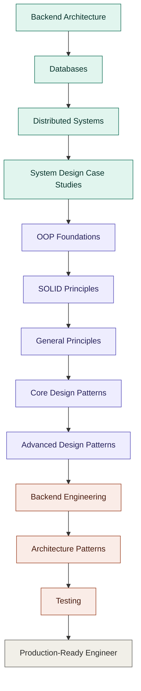

# The Complete Backend & Software Engineering Reference

A field guide to the concepts that separate someone who "knows APIs" from someone who can architect systems. Each entry covers what the concept actually is, where it belongs, and what it costs you.

---

## Roadmap Flow

*Teal = systems foundations, purple = design thinking, coral = engineering practice.*

---

## Phase 1 — Backend Architecture

### REST API Design
**Definition:** An architectural style for networked applications where resources are exposed as URLs and manipulated through standard HTTP verbs (GET, POST, PUT, DELETE, PATCH), with responses typically in JSON.
**Where/When to use:** Public-facing APIs, CRUD-heavy applications, any service that needs broad client compatibility (web, mobile, third parties).
**Advantages:** Simple mental model, stateless and cacheable, huge tooling ecosystem, easy to document and test.
**Disadvantages:** Over-fetching/under-fetching of data, versioning can get messy, not ideal for real-time or highly relational queries.

### API Versioning
**Definition:** The practice of managing changes to an API's contract over time (via URL paths, headers, or query params) so existing clients don't break when the API evolves.
**Where/When to use:** Any API with external consumers, or internal APIs shared across teams that release independently.
**Advantages:** Backward compatibility, safer iteration, clear deprecation paths.
**Disadvantages:** Maintaining multiple versions adds code and testing overhead; poor versioning strategy leads to fragmentation.

### Microservices
**Definition:** An architectural approach where an application is decomposed into small, independently deployable services, each owning its own data and communicating over the network.
**Where/When to use:** Large systems with multiple teams, components with very different scaling needs, or organizations wanting independent deployment cycles.
**Advantages:** Independent scaling and deployment, technology flexibility per service, fault isolation.
**Disadvantages:** Operational complexity, network latency between services, distributed debugging is hard, data consistency becomes a real problem.

### Monolith vs Microservices
**Definition:** A monolith is a single deployable unit containing all application logic; microservices split that logic into independently deployable units. The comparison is about where you draw deployment and ownership boundaries.
**Where/When to use:** Monolith for small teams, early-stage products, or when speed of iteration matters most. Microservices once scale, team size, or independent-release needs outgrow a monolith.
**Advantages (Monolith):** Simple to develop, test, deploy, and reason about; no network overhead between components.
**Disadvantages (Monolith):** Scaling is all-or-nothing, a bug can bring down the whole app, harder for large teams to work in parallel.

### API Gateway
**Definition:** A single entry point that sits in front of backend services, handling routing, authentication, rate limiting, and request aggregation.
**Where/When to use:** Microservice architectures where clients shouldn't talk to individual services directly.
**Advantages:** Centralizes cross-cutting concerns (auth, logging, throttling), simplifies client-side integration.
**Disadvantages:** Can become a single point of failure or a performance bottleneck if not scaled properly; adds another moving part to operate.

### Service Discovery
**Definition:** A mechanism that lets services find each other's network locations dynamically, instead of relying on hardcoded addresses.
**Where/When to use:** Dynamic environments where service instances scale up/down or move (containers, Kubernetes, cloud auto-scaling).
**Advantages:** Enables elastic scaling, removes manual configuration, supports self-healing infrastructure.
**Disadvantages:** Adds a dependency (the discovery service itself must be highly available), extra operational complexity.

### Load Balancer
**Definition:** A component that distributes incoming traffic across multiple backend instances to avoid overloading any single one.
**Where/When to use:** Any system with more than one instance of a service, especially public-facing ones needing high availability.
**Advantages:** Improves availability and fault tolerance, enables horizontal scaling, smooths out traffic spikes.
**Disadvantages:** Adds latency and a potential single point of failure if not made redundant itself; requires health-check tuning.

### Reverse Proxy
**Definition:** A server that sits between clients and backend servers, forwarding client requests to the appropriate backend and returning the response as if it came from the proxy itself.
**Where/When to use:** SSL termination, request routing, caching static content, hiding internal server topology.
**Advantages:** Centralizes security and routing logic, can offload SSL and compression from application servers.
**Disadvantages:** Extra network hop, misconfiguration can cause outages or expose internal errors.

### CDN (Content Delivery Network)
**Definition:** A geographically distributed network of servers that caches and serves content closer to the end user.
**Where/When to use:** Static assets (images, JS, CSS, video), globally distributed audiences, anything latency-sensitive.
**Advantages:** Drastically reduced latency, reduced origin server load, built-in DDoS resilience.
**Disadvantages:** Cache invalidation is tricky, added cost, not useful for highly dynamic/personalized content.

### Circuit Breaker
**Definition:** A pattern that stops calling a failing downstream service after a threshold of failures, "opening the circuit" to prevent cascading failure, and periodically testing if it has recovered.
**Where/When to use:** Any call to an external dependency or microservice that could fail or slow down.
**Advantages:** Prevents cascading failures, gives failing services time to recover, improves overall system resilience.
**Disadvantages:** Adds complexity and tuning (thresholds, timeouts), can mask underlying issues if not monitored.

### Retry Pattern
**Definition:** Automatically re-attempting a failed operation, often with exponential backoff and jitter, before giving up.
**Where/When to use:** Transient failures like network blips, timeouts, or temporary unavailability.
**Advantages:** Improves resilience against short-lived failures with minimal user impact.
**Disadvantages:** Can worsen outages if retries aren't backed off properly (retry storms), risk of duplicate side effects without idempotency.

### Saga Pattern
**Definition:** A way to manage distributed transactions across microservices using a sequence of local transactions, each with a compensating action if a later step fails.
**Where/When to use:** Multi-service business transactions (e.g., order → payment → inventory) where a two-phase commit isn't practical.
**Advantages:** Avoids distributed locking, keeps services loosely coupled, works well with eventual consistency.
**Disadvantages:** Complex to design and debug, compensating transactions aren't always straightforward to implement correctly.

### Event-Driven Architecture
**Definition:** A design where services communicate by producing and consuming events asynchronously, typically through a message broker, rather than direct calls.
**Where/When to use:** Systems needing loose coupling, high throughput, or where components need to react to state changes without polling.
**Advantages:** Decouples producers from consumers, scales well, naturally supports audit trails and replay.
**Disadvantages:** Harder to trace a request's full path, eventual consistency complicates reasoning, debugging requires good observability tooling.

### WebSockets
**Definition:** A protocol providing full-duplex, persistent communication channels over a single TCP connection, allowing real-time bidirectional data exchange.
**Where/When to use:** Chat applications, live dashboards, multiplayer games, anything needing continuous low-latency updates.
**Advantages:** True real-time communication, lower overhead than repeated HTTP polling.
**Disadvantages:** Connections are stateful and harder to load balance and scale, more complex infrastructure than plain HTTP.

### gRPC
**Definition:** A high-performance RPC framework using HTTP/2 and Protocol Buffers for efficient, strongly typed service-to-service communication.
**Where/When to use:** Internal microservice-to-microservice communication where performance and strict contracts matter.
**Advantages:** Fast binary serialization, strong typing via schemas, built-in streaming support.
**Disadvantages:** Less human-readable than JSON/REST, weaker browser support, steeper learning curve.

---

## Phase 2 — Databases

### ACID
**Definition:** A set of properties—Atomicity, Consistency, Isolation, Durability—that guarantee reliable database transactions.
**Where/When to use:** Financial systems, inventory management, anything where partial or corrupted writes are unacceptable.
**Advantages:** Strong data integrity guarantees, predictable behavior under failure.
**Disadvantages:** Can limit throughput and horizontal scalability compared to systems that relax these guarantees.

### Transactions
**Definition:** A grouped sequence of database operations that either all succeed or all fail together, treated as a single unit of work.
**Where/When to use:** Any operation touching multiple related records that must stay consistent (e.g., transferring money between accounts).
**Advantages:** Prevents partial updates, simplifies error handling and rollback logic.
**Disadvantages:** Long-running transactions can hold locks and hurt concurrency and performance.

### Isolation Levels
**Definition:** Settings that define how visible one transaction's changes are to concurrent transactions (Read Uncommitted, Read Committed, Repeatable Read, Serializable).
**Where/When to use:** Tuning the tradeoff between consistency and concurrency based on workload sensitivity.
**Advantages:** Flexibility to balance correctness against performance for a given use case.
**Disadvantages:** Lower isolation levels risk anomalies (dirty reads, phantom reads); higher levels reduce concurrency.

### Indexing
**Definition:** A data structure (commonly B-trees or hash maps) that speeds up data retrieval at the cost of extra storage and slower writes.
**Where/When to use:** Columns frequently used in WHERE clauses, JOINs, or ORDER BY.
**Advantages:** Dramatically faster reads and lookups.
**Disadvantages:** Slower writes/updates, extra disk space, over-indexing can hurt more than it helps.

### Query Optimization
**Definition:** The process of restructuring queries or schema usage so the database engine executes them more efficiently.
**Where/When to use:** Whenever queries are slow, under high load, or scanning more rows than necessary.
**Advantages:** Lower latency, reduced infrastructure cost, better user experience.
**Disadvantages:** Requires deep understanding of the query planner; premature optimization can waste engineering time.

### Joins
**Definition:** SQL operations that combine rows from two or more tables based on a related column.
**Where/When to use:** Relational data models where information is normalized across multiple tables.
**Advantages:** Avoids data duplication, keeps data model clean and consistent.
**Disadvantages:** Expensive on large datasets, especially across many tables; can become a scaling bottleneck.

### Normalization
**Definition:** Structuring a relational database to reduce redundancy by splitting data into related tables.
**Where/When to use:** Transactional systems (OLTP) where data integrity and update consistency matter most.
**Advantages:** Eliminates duplicate data, reduces update anomalies, keeps storage efficient.
**Disadvantages:** More joins needed for reads, can hurt read performance at scale.

### Denormalization
**Definition:** Intentionally introducing redundancy into a database to reduce the need for joins and speed up reads.
**Where/When to use:** Read-heavy systems (OLAP, reporting, caching layers) where read speed outweighs storage cost.
**Advantages:** Faster reads, simpler queries.
**Disadvantages:** Data duplication risks inconsistency, more complex updates to keep copies in sync.

### Locks
**Definition:** Mechanisms that prevent concurrent transactions from conflicting by restricting access to a resource.
**Where/When to use:** Any concurrent write scenario where correctness depends on preventing simultaneous modification.
**Advantages:** Guarantees data correctness under concurrency.
**Disadvantages:** Can cause contention, deadlocks, and reduced throughput.

### Optimistic Locking
**Definition:** A concurrency strategy that assumes conflicts are rare — it lets transactions proceed and checks for conflicts (often via a version number) only at commit time.
**Where/When to use:** Low-contention environments where most operations don't actually collide.
**Advantages:** No blocking, better throughput in low-conflict scenarios.
**Disadvantages:** Conflicts still require retries, can waste work if collisions are frequent.

### Pessimistic Locking
**Definition:** A concurrency strategy that locks a resource up front before any transaction can modify it, blocking others until the lock is released.
**Where/When to use:** High-contention environments where conflicts are likely and correctness must be guaranteed immediately.
**Advantages:** Prevents conflicts entirely, simpler reasoning about correctness.
**Disadvantages:** Reduces concurrency, risk of deadlocks and blocked users.

### Replication
**Definition:** Copying data across multiple database nodes to improve availability and read throughput.
**Where/When to use:** High-availability systems, read-heavy workloads that benefit from distributing reads across replicas.
**Advantages:** Improves fault tolerance, enables read scaling, supports disaster recovery.
**Disadvantages:** Replication lag can cause stale reads, added infrastructure and consistency complexity.

### Sharding
**Definition:** Splitting a database horizontally across multiple machines, each holding a subset of the data.
**Where/When to use:** Datasets too large for a single machine, or write throughput exceeding what one node can handle.
**Advantages:** Enables horizontal scaling of both storage and write throughput.
**Disadvantages:** Cross-shard queries and joins become complex, rebalancing shards is operationally hard.

### CAP Theorem
**Definition:** States that a distributed system can only guarantee two of three properties at once during a network partition: Consistency, Availability, and Partition Tolerance.
**Where/When to use:** Any time you're choosing a distributed database or designing a distributed system's failure behavior.
**Advantages:** Gives a clear mental framework for making explicit tradeoffs rather than assuming you can have it all.
**Disadvantages:** Often oversimplified in practice; real systems live on a spectrum rather than picking two extremes cleanly.

---

## Phase 3 — Distributed Systems Fundamentals

*(Consistency, Availability, Partition Tolerance, Eventual Consistency, and CAP Theorem are covered above — they apply identically here, just at the whole-system level rather than just the database layer.)*

### Distributed Cache
**Definition:** A cache layer (e.g., Redis, Memcached) shared across multiple application instances instead of living in a single process's memory.
**Where/When to use:** Multi-instance applications needing shared, low-latency access to frequently used data.
**Advantages:** Reduces database load, consistent cache view across instances, huge latency wins.
**Disadvantages:** Adds a network hop versus in-process caching, cache invalidation and staleness must be managed carefully.

### Distributed Lock
**Definition:** A locking mechanism that coordinates mutual exclusion across multiple machines, typically implemented via tools like Redis (Redlock) or ZooKeeper.
**Where/When to use:** Preventing duplicate processing or race conditions across multiple service instances (e.g., cron jobs, leader-only tasks).
**Advantages:** Enables safe coordination in distributed environments.
**Disadvantages:** Hard to get truly correct (clock drift, network partitions), adds a critical dependency that must itself be highly available.

### Leader Election
**Definition:** A process by which nodes in a distributed system agree on a single node to act as coordinator or leader.
**Where/When to use:** Systems needing a single source of truth for certain operations (e.g., primary database node, job scheduler).
**Advantages:** Simplifies coordination by avoiding conflicting concurrent decisions.
**Disadvantages:** Leader becomes a potential bottleneck or single point of failure if failover isn't handled well.

### Consensus
**Definition:** The general problem of getting distributed nodes to agree on a single value or state despite failures.
**Where/When to use:** Any system requiring strong agreement across nodes — configuration stores, distributed databases, coordination services.
**Advantages:** Enables strong consistency guarantees in distributed environments.
**Disadvantages:** Consensus algorithms have real performance costs (latency, message overhead) and are notoriously hard to implement correctly.

### ZooKeeper
**Definition:** A centralized coordination service providing primitives like configuration management, naming, and distributed locks, built on a consensus protocol.
**Where/When to use:** Coordinating distributed systems (e.g., Kafka historically used it for broker coordination).
**Advantages:** Battle-tested, provides strong consistency guarantees for coordination tasks.
**Disadvantages:** Adds operational overhead as another stateful system to run and maintain; increasingly being replaced by simpler alternatives.

### Raft
**Definition:** A consensus algorithm designed to be more understandable than Paxos, using leader election and log replication to keep distributed nodes in sync.
**Where/When to use:** Building or choosing distributed systems needing strong consistency (e.g., etcd, Consul).
**Advantages:** Easier to reason about and implement correctly than Paxos, well documented.
**Disadvantages:** Still adds latency for consensus rounds, leader-based design can bottleneck under heavy load.

### Paxos
**Definition:** A foundational consensus algorithm for achieving agreement among distributed nodes in the presence of failures.
**Where/When to use:** Systems requiring provably correct distributed agreement, often as the theoretical basis for other tools.
**Advantages:** Rigorously proven correctness properties.
**Disadvantages:** Notoriously difficult to understand and implement correctly; rarely used directly in its original form.

### Gossip Protocol
**Definition:** A decentralized communication method where nodes periodically exchange state information with random peers, spreading data through the cluster like a rumor.
**Where/When to use:** Large clusters needing eventually-consistent state propagation without a central coordinator (e.g., Cassandra membership).
**Advantages:** Highly scalable and fault-tolerant, no single point of failure.
**Disadvantages:** Propagation isn't instant, eventual consistency means temporary state disagreement across nodes.

---

## Phase 4 — System Design Case Studies

These aren't concepts so much as composite exercises that force you to apply everything above together.

### URL Shortener
**Definition:** A service that maps long URLs to short, unique identifiers and redirects users when the short link is visited.
**Where/When to use as a learning exercise:** Great entry-level system design problem — teaches hashing/encoding, database design, and redirect performance.
**Advantages of studying it:** Simple enough to reason about fully, but touches caching, database scaling, and uniqueness generation.
**Disadvantages/limits:** Doesn't expose you to more complex concerns like real-time messaging or media processing.

### WhatsApp
**Definition:** A real-time messaging platform requiring low-latency delivery, message ordering, and offline sync.
**Where/When to use as a learning exercise:** Teaches WebSockets, message queues, delivery guarantees, and end-to-end encryption concerns.
**Advantages of studying it:** Forces you to think about consistency vs. availability trade-offs in a very tangible product.
**Disadvantages/limits:** Encryption and multi-device sync add real complexity that's easy to hand-wave in interviews.

### Uber
**Definition:** A real-time location-based matching platform connecting riders and drivers.
**Where/When to use as a learning exercise:** Teaches geospatial indexing, real-time matching algorithms, and high write-throughput systems.
**Advantages of studying it:** Combines distributed systems, geospatial data structures, and dynamic pricing logic.
**Disadvantages/limits:** Genuinely hard — easy to underestimate the real-time matching complexity.

### YouTube
**Definition:** A video hosting and streaming platform requiring massive storage, transcoding, and global content delivery.
**Where/When to use as a learning exercise:** Teaches CDN usage, video encoding pipelines, and metadata/database design at scale.
**Advantages of studying it:** Strong example of storage/compute separation and CDN-heavy architecture.
**Disadvantages/limits:** Video processing pipelines are a specialized domain most engineers won't build from scratch.

### Instagram
**Definition:** A photo/video sharing social platform with feeds, likes, and follower graphs.
**Where/When to use as a learning exercise:** Teaches feed generation strategies (push vs. pull), graph data modeling, and caching at scale.
**Advantages of studying it:** Excellent example of the fan-out problem and read-heavy system design.
**Disadvantages/limits:** Recommendation/ranking systems add ML complexity beyond pure system design.

### Dropbox
**Definition:** A file storage and synchronization service handling versioning, conflict resolution, and large file transfer.
**Where/When to use as a learning exercise:** Teaches chunking large files, deduplication, sync conflict resolution, and metadata management.
**Advantages of studying it:** Good exposure to storage systems and consistency across devices.
**Disadvantages/limits:** Sync/conflict-resolution edge cases are deep enough to be a specialty of their own.

### Netflix
**Definition:** A video streaming service focused on adaptive bitrate streaming, personalization, and global scale delivery.
**Where/When to use as a learning exercise:** Teaches microservices at extreme scale, chaos engineering, and content delivery strategy.
**Advantages of studying it:** One of the best real-world examples of resilience engineering (circuit breakers, retries, chaos testing).
**Disadvantages/limits:** Their scale and org structure aren't representative of what most companies need.

### Google Drive
**Definition:** A cloud storage and real-time collaborative document platform.
**Where/When to use as a learning exercise:** Teaches operational transformation/CRDTs for collaborative editing, plus storage and permissions design.
**Advantages of studying it:** Strong exposure to real-time collaboration algorithms, a genuinely hard distributed systems problem.
**Disadvantages/limits:** Collaborative editing algorithms (OT/CRDT) require significant additional study beyond general system design.

### Twitter (X)
**Definition:** A real-time social feed platform with extremely high read-to-write ratios and viral fan-out patterns.
**Where/When to use as a learning exercise:** Teaches timeline generation, fan-out-on-write vs. fan-out-on-read, and handling celebrity/viral spikes.
**Advantages of studying it:** Classic example for understanding hot-key and fan-out problems at scale.
**Disadvantages/limits:** Trending/search ranking systems add complexity beyond core feed delivery.

### Payment Gateway
**Definition:** A system that securely processes financial transactions between customers, merchants, and banks.
**Where/When to use as a learning exercise:** Teaches idempotency, strong consistency, security/compliance (PCI-DSS), and distributed transaction handling.
**Advantages of studying it:** Forces rigorous thinking about correctness, idempotency, and failure handling — money can't be "eventually consistent."
**Disadvantages/limits:** Real payment systems involve heavy regulatory and compliance overhead that's hard to simulate in a learning exercise.

---

## Phase 5 — OOP Foundations

### Encapsulation
**Definition:** Bundling data and the methods that operate on it into a single unit, while restricting direct access to internal state.
**Where/When to use:** Anywhere you want to protect an object's internal consistency from external interference.
**Advantages:** Reduces coupling, protects invariants, makes internal changes safer.
**Disadvantages:** Overuse of getters/setters can just re-expose everything without real protection, adding boilerplate without real benefit.

### Abstraction
**Definition:** Exposing only the essential features of an object while hiding implementation details.
**Where/When to use:** Designing interfaces or APIs where consumers shouldn't need to know internal mechanics.
**Advantages:** Simplifies usage, allows implementation to change without breaking consumers.
**Disadvantages:** Too many abstraction layers can obscure what's actually happening, making debugging harder.

### Inheritance
**Definition:** A mechanism where a class derives properties and behavior from a parent class.
**Where/When to use:** True "is-a" relationships where subclasses genuinely specialize a shared base behavior.
**Advantages:** Code reuse, natural hierarchical modeling.
**Disadvantages:** Tight coupling between parent and child, fragile base class problem, often overused where composition would be better.

### Polymorphism
**Definition:** The ability for different classes to be treated through a common interface, with each implementing behavior differently.
**Where/When to use:** Whenever you want interchangeable implementations behind a shared contract (e.g., different payment processors).
**Advantages:** Extensible code, avoids large conditional branches based on type.
**Disadvantages:** Can make control flow harder to trace without good tooling or documentation.

---

## Phase 6 — SOLID Principles

### SRP — Single Responsibility Principle
**Definition:** A class or module should have only one reason to change — one job.
**Where/When to use:** Any time a class is accumulating unrelated responsibilities.
**Advantages:** Easier testing, easier to understand and modify in isolation.
**Disadvantages:** Taken too far, leads to an explosion of tiny classes that are hard to navigate.

### OCP — Open/Closed Principle
**Definition:** Software entities should be open for extension but closed for modification.
**Where/When to use:** Systems expected to grow new behaviors over time (e.g., adding new payment types).
**Advantages:** New functionality added without touching (and risking) existing tested code.
**Disadvantages:** Requires good upfront abstraction; over-applying it prematurely can lead to needless complexity ("just in case" extensibility).

### LSP — Liskov Substitution Principle
**Definition:** Subtypes must be substitutable for their base types without breaking the correctness of the program.
**Where/When to use:** Whenever using inheritance, to validate that a subclass is a true behavioral substitute.
**Advantages:** Prevents subtle bugs from subclasses that violate expected behavior.
**Disadvantages:** Easy to violate unintentionally, especially with deep inheritance hierarchies.

### ISP — Interface Segregation Principle
**Definition:** Clients should not be forced to depend on interfaces they don't use — prefer many small, specific interfaces over one large one.
**Where/When to use:** Designing interfaces consumed by multiple, differently-needs clients.
**Advantages:** Reduces unnecessary coupling, avoids forcing implementers to stub unused methods.
**Disadvantages:** Too much segregation can fragment the codebase into many small interfaces that are hard to track.

### DIP — Dependency Inversion Principle
**Definition:** High-level modules should not depend on low-level modules; both should depend on abstractions.
**Where/When to use:** Decoupling business logic from infrastructure details (databases, external APIs).
**Advantages:** Improves testability (easy to mock), makes swapping implementations painless.
**Disadvantages:** Adds indirection that can make code harder to follow for newcomers.

---

## Phase 7 — General Principles

### DRY — Don't Repeat Yourself
**Definition:** Every piece of knowledge should have a single, unambiguous representation in a system.
**Where/When to use:** Whenever logic or knowledge is duplicated across the codebase.
**Advantages:** Easier maintenance, single source of truth reduces bugs from inconsistent updates.
**Disadvantages:** Over-applying DRY to superficially similar code can create wrong, brittle abstractions ("premature abstraction").

### KISS — Keep It Simple, Stupid
**Definition:** Favor the simplest solution that solves the problem, avoiding unnecessary complexity.
**Where/When to use:** Always as a default bias, especially early in a project's life.
**Advantages:** Easier to understand, test, and maintain.
**Disadvantages:** Can be used to justify under-engineering systems that genuinely need more robustness.

### YAGNI — You Aren't Gonna Need It
**Definition:** Don't build functionality until it's actually required.
**Where/When to use:** Resisting speculative features or overly generic frameworks built "just in case."
**Advantages:** Saves time, avoids maintaining unused code, keeps the codebase focused.
**Disadvantages:** Can lead to costly rework if a genuinely foreseeable need is ignored entirely.

### High Cohesion
**Definition:** Elements within a module should be closely related and focused on a single purpose.
**Where/When to use:** Structuring modules/classes so related logic lives together.
**Advantages:** Easier to understand and maintain, changes are localized.
**Disadvantages:** Pursuing cohesion without regard for coupling can still yield a poorly structured system overall.

### Low Coupling
**Definition:** Minimizing dependencies between modules so changes in one don't ripple through others.
**Where/When to use:** Designing module boundaries, especially across team ownership lines.
**Advantages:** Improves flexibility, testability, and independent deployability.
**Disadvantages:** Reducing coupling too aggressively can add indirection and duplicate logic.

### Separation of Concerns
**Definition:** Dividing a program into distinct sections, each addressing a separate concern (e.g., UI, business logic, data access).
**Where/When to use:** Structuring any non-trivial application's architecture.
**Advantages:** Improves maintainability, enables parallel work across concerns.
**Disadvantages:** Too many layers of separation can add overhead and indirection for simple problems.

### Information Hiding
**Definition:** Concealing internal implementation details of a module from the rest of the system.
**Where/When to use:** Designing module boundaries and public interfaces.
**Advantages:** Reduces the blast radius of internal changes, protects invariants.
**Disadvantages:** Can obscure necessary details from consumers, hurting debuggability if taken too far.

### Composition over Inheritance
**Definition:** Preferring to build behavior by combining smaller objects rather than through class inheritance hierarchies.
**Where/When to use:** When behavior needs to be mixed and matched flexibly, rather than fitting a strict "is-a" hierarchy.
**Advantages:** More flexible, avoids fragile deep inheritance chains.
**Disadvantages:** Can require more boilerplate to wire components together explicitly.

### Program to Interfaces
**Definition:** Writing code against abstractions/interfaces rather than concrete implementations.
**Where/When to use:** Anywhere implementations might change or need to be swapped/mocked (e.g., for testing).
**Advantages:** Improves flexibility and testability, decouples code from specific implementations.
**Disadvantages:** Adds an abstraction layer that's unnecessary overhead for genuinely simple, unchanging logic.

### Law of Demeter
**Definition:** An object should only talk to its immediate collaborators, not reach through them to their internals ("don't talk to strangers").
**Where/When to use:** Preventing long method chains like `a.getB().getC().getD()`.
**Advantages:** Reduces coupling, hides internal object graphs.
**Disadvantages:** Can lead to a proliferation of thin wrapper/delegate methods if followed too rigidly.

---

## Phase 8 — Core Design Patterns

### Factory
**Definition:** A creational pattern that provides a method for creating objects without exposing the exact instantiation logic to the caller.
**Where/When to use:** When object creation logic is complex or needs to vary based on input/configuration.
**Advantages:** Centralizes creation logic, decouples client code from concrete classes.
**Disadvantages:** Adds an extra layer of indirection that can be unnecessary for simple object creation.

### Singleton
**Definition:** Ensures a class has only one instance and provides a global point of access to it.
**Where/When to use:** Shared resources like configuration managers or connection pools where a single instance is genuinely required.
**Advantages:** Controlled access to a shared resource, avoids redundant instantiation.
**Disadvantages:** Introduces global state, makes unit testing harder, can hide dependencies.

### Builder
**Definition:** Separates the construction of a complex object from its representation, allowing step-by-step construction.
**Where/When to use:** Objects with many optional parameters or complex construction steps.
**Advantages:** Improves readability over telescoping constructors, allows immutable objects to be built cleanly.
**Disadvantages:** Adds boilerplate for simple objects that don't need it.

### Adapter
**Definition:** Converts the interface of one class into another interface that clients expect.
**Where/When to use:** Integrating a third-party or legacy component with an incompatible interface.
**Advantages:** Enables reuse of existing code without modification.
**Disadvantages:** Can accumulate as a layer of "glue code" if overused instead of fixing root interface mismatches.

### Strategy
**Definition:** Defines a family of interchangeable algorithms and lets the client choose which one to use at runtime.
**Where/When to use:** When multiple variations of an algorithm need to be swappable (e.g., different sorting or pricing strategies).
**Advantages:** Avoids large conditional blocks, easy to add new strategies without modifying existing code.
**Disadvantages:** Increases the number of classes/objects in the system.

### Observer
**Definition:** Defines a one-to-many dependency so that when one object changes state, all its dependents are notified automatically.
**Where/When to use:** Event systems, UI updates, pub/sub-style notifications.
**Advantages:** Decouples subject from observers, supports dynamic subscription.
**Disadvantages:** Can lead to unexpected cascading updates and makes execution order harder to trace.

### Decorator
**Definition:** Attaches additional responsibilities to an object dynamically without modifying its structure.
**Where/When to use:** Adding optional behavior to objects (e.g., wrapping a data stream with compression or encryption).
**Advantages:** More flexible than static inheritance for adding behavior.
**Disadvantages:** Many small decorator layers can make debugging and understanding object behavior harder.

### Facade
**Definition:** Provides a simplified, unified interface to a complex subsystem of classes.
**Where/When to use:** Simplifying interaction with a complex library or set of subsystems for common use cases.
**Advantages:** Reduces complexity for clients, decouples client code from subsystem internals.
**Disadvantages:** Can become a "god object" if it tries to expose too much, or hide too much needed flexibility.

---

## Phase 9 — Advanced Design Patterns

### Abstract Factory
**Definition:** Provides an interface for creating families of related objects without specifying their concrete classes.
**Where/When to use:** When a system needs to work with multiple families of related products (e.g., UI themes with matching button/checkbox styles).
**Advantages:** Ensures consistency among related objects, isolates concrete classes from client code.
**Disadvantages:** Adding a new product family requires changing the factory interface, which can ripple through implementations.

### Prototype
**Definition:** Creates new objects by cloning an existing instance rather than instantiating from scratch.
**Where/When to use:** When object creation is expensive and similar objects are needed repeatedly.
**Advantages:** Avoids costly re-initialization, useful for objects with many configured properties.
**Disadvantages:** Cloning deep object graphs (deep copy) can be tricky to implement correctly.

### Bridge
**Definition:** Decouples an abstraction from its implementation so the two can vary independently.
**Where/When to use:** When both an abstraction and its implementation are expected to evolve separately.
**Advantages:** Avoids a combinatorial explosion of subclasses for every abstraction/implementation combination.
**Disadvantages:** Adds upfront design complexity that isn't justified for simple, stable hierarchies.

### Composite
**Definition:** Composes objects into tree structures to represent part-whole hierarchies, letting clients treat individual objects and compositions uniformly.
**Where/When to use:** Representing hierarchical structures like file systems, UI component trees, or org charts.
**Advantages:** Simplifies client code by treating leaf and composite nodes the same way.
**Disadvantages:** Can make it harder to restrict what types of children a component may have.

### Proxy
**Definition:** Provides a placeholder or surrogate for another object to control access to it (e.g., for lazy loading, access control, or logging).
**Where/When to use:** Controlling access to an expensive or sensitive resource.
**Advantages:** Adds control (caching, security, lazy init) without changing the real object's interface.
**Disadvantages:** Adds an extra layer of indirection, can obscure the real object's behavior.

### Flyweight
**Definition:** Minimizes memory usage by sharing as much data as possible between similar objects.
**Where/When to use:** Large numbers of similar objects where most of their state can be shared (e.g., rendering characters in a text editor).
**Advantages:** Significant memory savings at scale.
**Disadvantages:** Adds complexity by separating intrinsic (shared) and extrinsic (unique) state.

### Command
**Definition:** Encapsulates a request as an object, allowing parameterization, queuing, and undo/redo of operations.
**Where/When to use:** Implementing undo/redo, task queues, or decoupling the invoker of an action from the object that performs it.
**Advantages:** Decouples sender and receiver, supports queuing/logging/undo functionality naturally.
**Disadvantages:** Introduces an extra object for every action, which can be overkill for simple operations.

### State
**Definition:** Allows an object to alter its behavior when its internal state changes, appearing as if it changed class.
**Where/When to use:** Objects with complex state-dependent behavior (e.g., order status: pending, shipped, delivered).
**Advantages:** Avoids large conditional statements based on state, makes state transitions explicit.
**Disadvantages:** Increases the number of classes, one per state.

### Iterator
**Definition:** Provides a way to access elements of a collection sequentially without exposing its underlying representation.
**Where/When to use:** Traversing collections while hiding their internal structure.
**Advantages:** Uniform traversal interface regardless of the collection's implementation.
**Disadvantages:** Rarely needs to be hand-built today since most languages provide this natively.

### Mediator
**Definition:** Defines an object that encapsulates how a set of objects interact, reducing direct dependencies between them.
**Where/When to use:** Complex object interactions where many-to-many communication is becoming tangled (e.g., UI component coordination).
**Advantages:** Reduces coupling between interacting objects, centralizes complex communication logic.
**Disadvantages:** The mediator itself can become an overly complex "god object" if not carefully scoped.

### Memento
**Definition:** Captures and externalizes an object's internal state so it can be restored later, without violating encapsulation.
**Where/When to use:** Implementing undo functionality or checkpoints/snapshots.
**Advantages:** Restores previous states without exposing internal object details.
**Disadvantages:** Storing many snapshots can be memory-intensive if not managed carefully.

### Chain of Responsibility
**Definition:** Passes a request along a chain of handlers until one of them handles it.
**Where/When to use:** Request processing pipelines like middleware, validation chains, or approval workflows.
**Advantages:** Decouples sender from receiver, easy to add/remove handlers.
**Disadvantages:** No guarantee a request will be handled, and debugging the chain's flow can be difficult.

### Template Method
**Definition:** Defines the skeleton of an algorithm in a base class, letting subclasses override specific steps without changing the overall structure.
**Where/When to use:** Algorithms that share a common structure but differ in specific steps (e.g., data import pipelines with varying parsing logic).
**Advantages:** Promotes code reuse of the overall algorithm shape.
**Disadvantages:** Relies on inheritance, which can be more rigid than composition-based alternatives.

### Visitor
**Definition:** Lets you define a new operation on a set of objects without changing the classes of the elements it operates on.
**Where/When to use:** Performing varied operations across a stable object structure (e.g., AST traversal in compilers).
**Advantages:** Adds new operations without modifying existing element classes.
**Disadvantages:** Adding a new element type requires updating every visitor, which can be brittle.

### Interpreter
**Definition:** Defines a representation for a language's grammar along with an interpreter to process sentences in that language.
**Where/When to use:** Building small domain-specific languages or expression evaluators.
**Advantages:** Clean way to model and evaluate grammar-based rules.
**Disadvantages:** Doesn't scale well to complex grammars — parser generators are usually a better fit at that point.

---

## Phase 10 — Backend Engineering

### Dependency Injection
**Definition:** A technique where an object's dependencies are provided externally rather than created internally.
**Where/When to use:** Virtually any non-trivial application, especially where testability matters.
**Advantages:** Improves testability (easy mocking), decouples components, centralizes configuration.
**Disadvantages:** Can make code harder to trace without good tooling, DI frameworks add a learning curve.

### Thread Safety
**Definition:** A property of code that guarantees correct behavior when accessed by multiple threads concurrently.
**Where/When to use:** Shared mutable state accessed by concurrent processes or threads.
**Advantages:** Prevents race conditions and data corruption.
**Disadvantages:** Synchronization mechanisms add overhead and complexity, and can introduce deadlocks if misused.

### Immutability
**Definition:** Designing objects whose state cannot be changed once created.
**Where/When to use:** Concurrent systems, functional-style code, or any value that shouldn't change after creation (e.g., configuration).
**Advantages:** Eliminates a whole class of concurrency bugs, easier to reason about.
**Disadvantages:** Creating new copies for every change can increase memory usage and garbage collection pressure.

### Caching (Redis)
**Definition:** Storing frequently accessed data in fast in-memory storage (like Redis) to avoid recomputing or refetching it from slower sources.
**Where/When to use:** Expensive computations, frequent database reads, session storage, rate limiting counters.
**Advantages:** Major performance and latency improvements, reduces load on primary data stores.
**Disadvantages:** Cache invalidation is genuinely hard, stale data risk, adds another moving part to keep available.

### Idempotency
**Definition:** A property where performing an operation multiple times has the same effect as performing it once.
**Where/When to use:** Payment processing, retries over unreliable networks, any operation that might be duplicated.
**Advantages:** Makes retries safe, simplifies error recovery.
**Disadvantages:** Requires deliberate design (idempotency keys, deduplication logic) that adds implementation overhead.

### Authentication
**Definition:** The process of verifying who a user or system is.
**Where/When to use:** Any system that needs to know who is making a request.
**Advantages:** Establishes trusted identity as a foundation for security.
**Disadvantages:** Poorly implemented authentication is a top source of security vulnerabilities.

### Authorization
**Definition:** The process of determining what an authenticated user or system is allowed to do.
**Where/When to use:** Any system with differentiated access levels or permissions.
**Advantages:** Enforces least-privilege access, protects sensitive resources.
**Disadvantages:** Complex permission models (roles, scopes, hierarchies) can become difficult to maintain and audit.

### JWT (JSON Web Token)
**Definition:** A compact, self-contained token format used to securely transmit claims (like user identity) between parties, typically signed.
**Where/When to use:** Stateless authentication across services, especially in distributed/microservice systems.
**Advantages:** Stateless (no server-side session lookup needed), works well across service boundaries.
**Disadvantages:** Hard to revoke before expiry, token size can grow, must be handled carefully to avoid leaking sensitive claims.

### OAuth 2.0
**Definition:** An authorization framework that allows third-party applications to obtain limited access to a user's resources without exposing their credentials.
**Where/When to use:** "Login with Google/GitHub" flows, granting scoped API access to third-party apps.
**Advantages:** Avoids sharing passwords with third parties, supports fine-grained scopes.
**Disadvantages:** The spec has many flows and is easy to misconfigure insecurely if not well understood.

### Rate Limiting
**Definition:** Restricting the number of requests a client can make within a given time window.
**Where/When to use:** Public APIs, protecting against abuse, ensuring fair resource usage.
**Advantages:** Protects backend resources, mitigates abuse and denial-of-service risk.
**Disadvantages:** Overly strict limits can degrade legitimate user experience; requires careful tuning per use case.

### Message Queues
**Definition:** Middleware that allows asynchronous communication between services by placing messages in a queue for later processing.
**Where/When to use:** Decoupling producers and consumers, smoothing out traffic spikes, background job processing.
**Advantages:** Improves resilience and decoupling, absorbs load spikes gracefully.
**Disadvantages:** Adds operational complexity, message ordering and exactly-once delivery are nontrivial to guarantee.

### Kafka
**Definition:** A distributed event streaming platform designed for high-throughput, durable, ordered message logs.
**Where/When to use:** Event sourcing, log aggregation, real-time analytics pipelines, high-volume event streaming.
**Advantages:** Extremely high throughput, durable storage of event streams, supports replay.
**Disadvantages:** Operationally heavy to run and tune, steep learning curve compared to simpler queues.

### RabbitMQ
**Definition:** A message broker implementing traditional queuing protocols (like AMQP), focused on flexible routing of messages.
**Where/When to use:** Task queues, request/response patterns, complex routing needs between producers and consumers.
**Advantages:** Flexible routing, mature tooling, simpler mental model than a log-based system for many use cases.
**Disadvantages:** Lower throughput ceiling than Kafka for very high-volume event streaming use cases.

---

## Phase 11 — Architecture Patterns

### Clean Architecture
**Definition:** An architectural style that organizes code into concentric layers, with business logic at the center, independent of frameworks, UI, or databases.
**Where/When to use:** Long-lived, complex applications where business logic needs to outlive specific technology choices.
**Advantages:** Highly testable, framework-agnostic core, easier to swap infrastructure.
**Disadvantages:** Significant upfront structure and boilerplate that can be overkill for small or short-lived projects.

### Domain Driven Design (DDD)
**Definition:** An approach to software design that models software closely around the business domain, using a shared "ubiquitous language" between developers and domain experts.
**Where/When to use:** Complex business domains where the logic itself is the hard part, not the technology.
**Advantages:** Keeps code aligned with real business rules, improves communication between engineers and stakeholders.
**Disadvantages:** Heavy process and modeling investment that's wasted on simple CRUD applications.

### CQRS (Command Query Responsibility Segregation)
**Definition:** Separates the models used for reading data (queries) from those used for writing data (commands).
**Where/When to use:** Systems with very different read and write workloads or scaling needs.
**Advantages:** Allows independent optimization and scaling of reads vs. writes.
**Disadvantages:** Adds architectural complexity and potential eventual consistency between the read and write models.

### Event Sourcing
**Definition:** Storing all changes to application state as a sequence of immutable events, rather than just the current state.
**Where/When to use:** Systems needing full audit trails, the ability to reconstruct past states, or complex event-driven workflows.
**Advantages:** Complete history and auditability, enables rebuilding state or debugging via replay.
**Disadvantages:** Querying current state requires replaying or maintaining projections, adding real complexity.

### Hexagonal Architecture
**Definition:** Also known as Ports and Adapters — isolates core application logic from external systems through defined ports and adapters.
**Where/When to use:** Applications needing to swap out external integrations (databases, APIs, UI) without touching core logic.
**Advantages:** High testability, decouples business logic from infrastructure details.
**Disadvantages:** Adds abstraction layers that can feel like unnecessary ceremony for simple applications.

### Onion Architecture
**Definition:** A layered architecture similar to Clean/Hexagonal, structuring dependencies to always point inward toward the domain core.
**Where/When to use:** Same general use case as Clean/Hexagonal — complex domains that need to be insulated from infrastructure churn.
**Advantages:** Strong separation of concerns, domain logic stays independent of frameworks.
**Disadvantages:** Overlapping in intent with Clean and Hexagonal architecture, choosing between them can itself cause unnecessary debate.

---

## Phase 12 — Testing

### Unit Testing
**Definition:** Testing individual units of code (usually functions or methods) in isolation from the rest of the system.
**Where/When to use:** Core business logic, edge cases, and any code with meaningful branching logic.
**Advantages:** Fast feedback, pinpoints exactly where a bug is, cheap to run frequently.
**Disadvantages:** Doesn't catch integration issues between components; a suite full of passing unit tests can still ship a broken system.

### Integration Testing
**Definition:** Testing how multiple components or systems work together (e.g., service plus database).
**Where/When to use:** Verifying that combined components behave correctly, especially around boundaries like databases or external APIs.
**Advantages:** Catches issues unit tests miss, validates real interactions between components.
**Disadvantages:** Slower and more brittle than unit tests, often requires more setup (test databases, containers).

### TDD (Test-Driven Development)
**Definition:** A development practice where tests are written before the implementation code, driving design through a red-green-refactor cycle.
**Where/When to use:** Complex logic where clear requirements exist and design benefits from being test-driven.
**Advantages:** Encourages testable design, produces a safety net from day one, clarifies requirements early.
**Disadvantages:** Can slow down initial development and doesn't fit well with exploratory or rapidly changing requirements.

### Mocking
**Definition:** Replacing real dependencies with controlled fake implementations during testing to isolate the unit under test.
**Where/When to use:** Testing code that depends on external systems (databases, APIs) without needing them to be live.
**Advantages:** Makes tests fast and deterministic, isolates the code being tested.
**Disadvantages:** Over-mocking can create tests that pass even when real integrations are broken, giving false confidence.

### Contract Testing
**Definition:** Verifying that the interactions between two services (a consumer and a provider) conform to a shared agreed-upon contract.
**Where/When to use:** Microservice architectures where services are developed and deployed independently.
**Advantages:** Catches breaking API changes early without needing full end-to-end integration environments.
**Disadvantages:** Requires discipline to keep contracts up to date, and adds another testing layer to maintain alongside unit and integration tests.

---

## How to Use This Reference

Read it top to bottom once to build a map of the territory, then treat it as a dictionary you return to. When you're designing a system, the real skill isn't knowing every pattern — it's knowing which handful of these actually apply to the problem in front of you, and being honest about what each one costs.